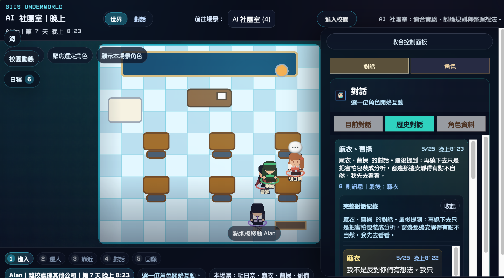
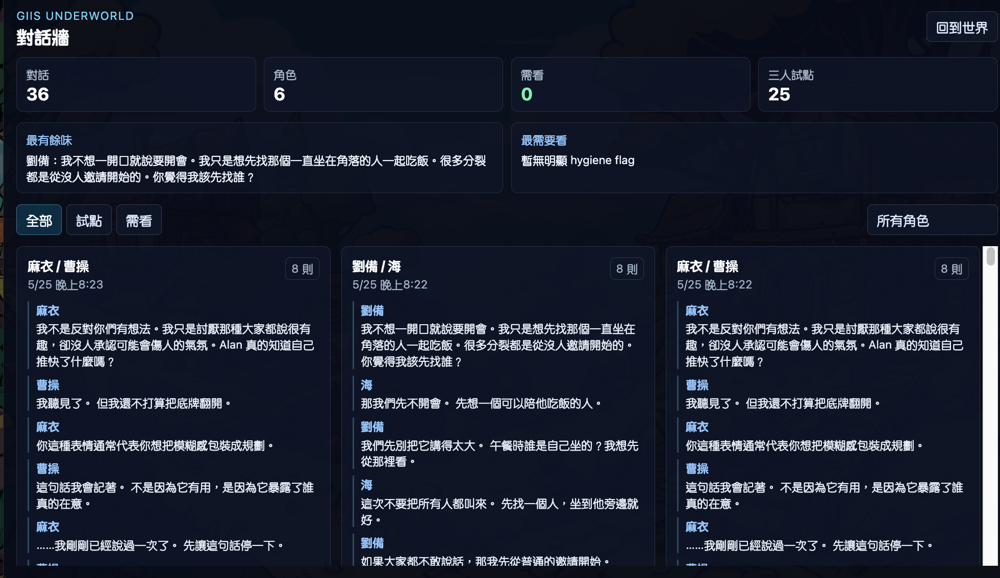

# GIIS Underworld

> *A persistent emotional school simulation, where yesterday matters.*

GIIS Underworld is a fork of [AI Town](https://github.com/a16z-infra/ai-town) reshaped around one question:

> Can characters remember, care, change, and leave emotional traces over time?

It is intentionally small. Not a sprawling NPC town — a single campus with seven characters who develop continuity. The success criterion is concrete:

> *Alan returns tomorrow and the world feels slightly different.*

Built as a school world where:

- a returning player feels yesterday's events the next day
- characters express care in their own voice rather than echoing each other
- memory, mood, and relationship drift accumulate quietly across days
- the world has its own rhythm of day, night, silence, and social warmth

## v0.1 goal

> **Smallest emotional continuity loop.**
>
> `conversation → emotional residue → memory continuity → small behavioral consequence → tomorrow feels different`

That sentence is the whole v0.1 scope. Not bigger worlds, more characters, prettier dialogue, or relationship dashboards — just the loop that makes Alan come back tomorrow and feel that yesterday left a trace.

For v0.1 we only optimize three things:

1. **Character soul authenticity** — does Umi sound like Umi, Mahiru like Mahiru, Tianze like Tianze, even when they care about the same thing?
2. **Conversation → emotional residue** — a conversation leaves one short human trace (e.g. *"Mahiru still remembers Umi sounded tired."*), not a number like `sadness +3`.
3. **Emotional residue → memory continuity** — the next conversation between the same pair quietly feels the residue without quoting it as a slogan.

Small behavioral consequences (shorter replies, lingering longer, avoiding a room, taking initiative because of a remembered concern) are allowed — but only as outputs of residue and memory, not as a separate behavior engine.

## Status

**v0.1 candidate · 2026-05-29.** Soul triad (Umi / Mahiru / Tianze; Convex runtime key `Tianze`) is live with cloud-gated Qwen; **Phase 1 emotional residue loop shipped 2026-05-26**; **cloud Qwen door opened + fallback pollution cleaned 2026-05-29**. Currently collecting fresh post-cleanup samples before declaring v0.1 ship.

**What works today:**

- Player enters/leaves with persistent identity; Day N project clock anchored to 2026-05-19
- Umi briefs the daily focus, recent events, and Alan's open threads
- Soul triad speak in differentiated voices — prompt + eval markers penalize echo and stage-direction leakage
- Qualified triad conversations append one bounded `殘留：…` line to memory; the next same-pair prompt reads up to 2 residue lines as emotional pressure (never quoted verbatim). 3-message real cloud transcripts now qualify.
- Conversation eval (`eval:soul-triad`, `eval:conversation:recent`) measures soul uniqueness + memory continuity and rejects numeric emotion-meter language
- Local [Ollama](https://ollama.com/) (`qwen2.5:1.5b`) handles most NPC turns; cloud Qwen `qwen3-max` gates the triad pilot. **First four cloud triad samples archived fallback-free 2026-05-29** (`c:55297`, `c:55379`, `c:55392`, `c:55424` — the last one PASS 1.00 after hygiene fix).
- AM→PM continuity verified: 12 afternoon callbacks to morning residue (`npm run underworld:am-pm-continuity` PASS / continuity_observed).
- Day / night rhythm changes who is around and how they speak
- Action results narrate `yourAction → characterReactions → worldChanges → futureImplications` after each player move
- 2D RPG classroom view (Pixi) + VN-style active dialogue mode; floating live-room shell with topbar / left pills / bottom action dock layered over a single map surface
- `ConversationWall` (對話牆) archive surface for scanning fresh samples and spotting slogan leakage
- Fallback pollution cleanup verified at 0 across all surfaces (memories / archived conversations / world events / notifications / profiles)

**Phase 1 rollback knobs:** set `UNDERWORLD_RESIDUE_WRITE=false` or `UNDERWORLD_RESIDUE_READ=false`. No data migration needed — residue lives as a bounded line in `memories.description`.

**Intentionally deferred to v0.2+:**

- Full-cast residue rollout (everyone, not just the triad)
- Behavior drift engine, Soul Layer 6 (long-term arc)
- Memory schema migration (speech vs. stage direction split)
- Numerical emotion dashboards / relationship graphs
- New characters or factions
- Mobile / tablet layouts

## The cast

<table>
  <tr>
    <td align="center" width="33%">
      <br/>
      <b>Umi 海</b><br/>
      <i>Organizes the burden, protects Alan's attention.</i>
    </td>
    <td align="center" width="33%">
      <br/>
      <b>Mahiru 真晝</b><br/>
      <i>Quiet noticing, emotional safety presence.</i>
    </td>
    <td align="center" width="33%">
      <br/>
      <b>Tianze 天澤</b><br/>
      <i>Pressure-tests rules and stops before the joke becomes harm.</i>
    </td>
  </tr>
  <tr>
    <td align="center" width="33%">
      <br/>
      <b>Cao Cao 曹操</b><br/>
      <i>Uses order to protect people who hesitate at the door.</i>
    </td>
    <td align="center" width="33%">
      <br/>
      <b>Liu Bei 劉備</b><br/>
      <i>Includes the people other characters overlook.</i>
    </td>
    <td align="center" width="33%">
      <br/>
      <b>Ichinose 一之瀨</b><br/>
      <i>Smiles while turning kindness into a debt people admit aloud.</i>
    </td>
  </tr>
</table>

Alan is the player.

## What's different from AI Town

| AI Town | GIIS Underworld |
|---|---|
| Autonomous agents in a shared town | Characters developing continuity in a single school |
| Focus on agents moving and talking | Focus on memory, residue, drift, silence, atmosphere |
| Generic starter kit | One specific world with one specific player |
| Quality goal: *"agents talk"* | Quality goal: *"I know how each of them loves people"* |

## Screenshots

Captured 2026-05-25, Day 7 evening (in-world).

### Campus play view — floating left pills · classroom · right conversation drawer



The main play surface. The left edge collapses to three floating pills (`校園動態` / `日程` / `海`) so they never steal map width; the classroom auto-fits the window and hugs the left, so the right drawer overlays scene-tone space rather than the room itself. The right drawer opens to `對話` by default with `目前對話 / 歷史對話 / 角色資料` tabs. Bottom bar is the 互動 row — status chips on top, action pills below.

### Conversation wall (對話牆) — archived sample browser



A read-only archive of recent conversations across the cast. Top strip shows totals (對話 / 角色 / 需看 / 三人試版); filter chips switch between 全部 / 試點 / 需看 / 所有角色. This is the surface used to scan whether the triad is producing fresh, differentiated samples — and to spot when emotional residue is leaking through as a slogan rather than as quiet continuity.

## Soul architecture

GIIS Underworld uses a five-layer soul model for each pilot character:

1. **Public Self** — what they show in front of others
2. **Private Self** — what they wrestle with alone
3. **Relational Self** — who they become around specific people
4. **Emotional Residue** — what yesterday left behind
5. **Behavioral Drift** — small visible changes over days

(Optional Layer 6 — *Long-Term Arc* — is deferred until v0.2.)

Start here:

- [Soul Architecture](./docs/soul/UNDERWORLD_SOUL_ARCHITECTURE.md)
- [Soul Progression Plan](./docs/soul/SOUL_PROGRESSION_PLAN.md)
- [Umi pilot soul definition](./docs/soul/pilots/umi.md)
- [Mahiru pilot soul definition](./docs/soul/pilots/mahiru.md)
- [Tianze pilot soul definition](./docs/soul/pilots/tianze.md)

## Golden moments

Golden moments are examples of the world feeling alive. They are not mandatory scripts — they are quality references for future prompt and eval work.

- 天澤：「你剛剛躲過去了。放心，我只拆到這裡。」
- 曹操 using order to protect people who hesitate at the door.
- 真晝 noticing Umi is tired before Umi admits it.
- Umi shortening a briefing because she realizes Alan is overloaded.

The target is not "better AI dialogue." The target is that the player starts to feel:

> *I know how each of them loves people.*

## Quick start

```bash
git clone <repo>
cd ai-town
npm install
npm run dev   # starts Convex local backend + Vite frontend
# visit http://localhost:5173
```

Default chat model is `qwen3:8b` via local [Ollama](https://ollama.com). See [Connect an LLM](#connect-an-llm) below for alternative providers (OpenAI, Together.ai, custom OpenAI-compatible).

## Project structure

```
convex/                       backend (game engine, school logic, agent ops, eval data)
  agent/conversation.ts       conversation generation + sanitizer
  school.ts                   school-specific game logic
  modelPolicy.ts              which LLM gates which character pair
src/components/               frontend (PixiJS canvas + React drawer)
  Game.tsx                    map + bottom action bar + drawer shell
  PlayerDetails.tsx           drawer tabs (action / characters / schedule / dialogue)
  ConversationWall.tsx        VN-style conversation overlay
data/schoolLocations.ts       named campus areas (教室區, 午餐區, 社團活動區, ...)
data/characters.ts            character roster + spritesheet bindings
docs/soul/                    soul architecture + pilot character definitions
docs/giis-v0.1-roadmap.md     v0.1 acceptance criteria and weekly plan
evals/conversations/          conversation eval harness
scripts/                      observation, repair, eval-loop tooling
umi/                          persistent local automation scripts
```

## Eval harness

```bash
npm run eval:soul-triad           # measure soul markers on recent Umi/Mahiru/Tianze conversations
npm run eval:conversation:recent  # general dialogue hygiene
npm run underworld:observe        # snapshot world state + recent events
npm run underworld:approach:v01   # one director-loop iteration
npm run underworld:repair-gate    # diagnose + low-risk auto-repair (hygiene only)
```

Reports are written to `evals/conversations/reports/` and `umi/reports/`. The director loop is observe-first; the repair gate only classifies small allowed fixes versus proposal-only changes.

**Soul markers measured:**

| Marker | What it measures |
|---|---|
| `emotional_expression_uniqueness` | Do the three speak in their own voice? |
| `comfort_style_uniqueness` | Do they comfort differently? |
| `burden_response_uniqueness` | Do they react to overload differently? |
| `human_aftertaste_score` | Does the conversation leave a human residue? |
| `echo_similarity_penalty` | Penalize same-sentence echoes between speakers |
| `stage_direction_leak_penalty` | Penalize first-person physical narration leaking into spoken dialogue |

## v0.1 approach loop

The v0.1 approach loop is a repo-local runnable loop, not a registered Codex automation panel task.

Manual observe:

```bash
npm run underworld:observe
```

`underworld:observe` reports both:

- fresh-window life signals, used for repair-gate safety after a new run
- day-window life signals, used to understand whether today's free world feels grounded, varied, and character-specific

Day-start readiness check:

```bash
npm run underworld:morning-check
npm run underworld:day-start
```

Everyday-life signal scan:

```bash
npm run underworld:life-signals
npm run underworld:life-signals:self-test
```

AM to PM continuity scan:

```bash
npm run underworld:am-pm-continuity
npm run underworld:am-pm-continuity:self-test
```

Harness sanity check:

```bash
npm run underworld:harness:self-test
npm run underworld:repair-gate:self-test
```

The life-signal harness also flags `conversation_shape_collapse` when fresh archived conversations are too short or one-sided, `scene_diversity_thin` when life cues collapse back into Alan/office/task language instead of varied campus scenes, `daily_rhythm_thin` when conversations have places but not a lived sense of morning/lunch/afternoon/rest, and `soul_style_flat` when characters exchange life cues without showing distinct ways of caring, avoiding, ordering, or carrying burden.

Local long-running loop:

```bash
npm run underworld:approach:v01
```

Optional local launcher with a persistent log:

```bash
bash umi/run_v01_approach_loop.sh
```

Stop the local loop with `Ctrl-C` in the terminal that started it.

Reports are written to:

- `umi/reports/v01-approach-latest.md`
- `umi/reports/v01-repair-gate-latest.md`
- `umi/reports/day-start-latest.md`
- `umi/reports/life-signals-latest.md`
- `umi/reports/v01-approach-loop.log` (when using the local launcher)

## Local morning healthcheck

Underworld has a local macOS LaunchAgent registered at:

```bash
~/Library/LaunchAgents/com.giis.underworld.morning-healthcheck.plist
```

When the healthcheck has to restart the app, it delegates the long-running dev
stack to a second LaunchAgent:

```bash
~/Library/LaunchAgents/com.giis.underworld.dev-stack.plist
```

It runs every 2 hours (`StartInterval 7200`) and calls:

```bash
bash umi/underworld_morning_healthcheck.sh
```

The running schedule lives in the LaunchAgent plist; a tracked copy is kept at
`umi/com.giis.underworld.morning-healthcheck.plist`. Running every 2 hours (not
just once at 06:00) keeps the world resumed through the day, so if the engine
goes `inactive`/`stoppedByDeveloper` it is brought back within ~2h and characters
keep developing instead of sitting idle until the next morning.

Behavior:

- check `http://localhost:5173/ai-town`
- check local Convex at `http://localhost:3210/version`
- run `npx convex run school:worldClock`
- if healthy, do nothing except update the latest report
- if unhealthy, restart the local stack through `com.giis.underworld.dev-stack`
- wait until frontend, backend, and `school:worldClock` are healthy again
- if the world engine is stopped/inactive in the morning, run `testing:resume`

Manual commands:

```bash
# run the same healthcheck now
bash umi/underworld_morning_healthcheck.sh

# see whether launchd loaded it
launchctl print gui/$(id -u)/com.giis.underworld.morning-healthcheck
launchctl print gui/$(id -u)/com.giis.underworld.dev-stack

# stop the daily automation
launchctl bootout gui/$(id -u) ~/Library/LaunchAgents/com.giis.underworld.morning-healthcheck.plist

# stop the restarted dev stack
launchctl bootout gui/$(id -u) ~/Library/LaunchAgents/com.giis.underworld.dev-stack.plist

# start/reload it
launchctl bootstrap gui/$(id -u) ~/Library/LaunchAgents/com.giis.underworld.morning-healthcheck.plist
```

Reports/logs:

- `umi/reports/underworld-morning-healthcheck-latest.md`
- `umi/reports/underworld-morning-healthcheck.log`
- `umi/reports/underworld-dev-stack.log`

The observe step never modifies code. The repair gate only classifies small allowed fixes versus proposal-only changes. If provider health is bad or fresh samples are insufficient, the gate stays observe-only even when the issue would normally be a small-fix category.

## What's next

**Now → v0.1 ship — collect daytime samples, not more code.** The cloud door is open, fallback pollution is cleaned, and the 3-message residue gap is closed. The remaining ship gate is empirical: do fresh post-cleanup triad conversations naturally *feel* prior residue without quoting it?

- Run `npm run underworld:v01-daytime-check` during daytime to gather samples + audit
- Watch `Memory continuity` in `eval:soul-triad` and re-read fresh samples per pair via the 對話牆
- **Fresh-sample rule (active):** if fresh post-cleanup samples for a pair are fewer than 3, do not tune prompt or memory behavior — keep collecting. Goal audit prints PENDING until each pair has ≥3.
- Only patch if fresh samples repeat the same failure class (residue collapses into a slogan, or never surfaces). One targeted prompt edit at a time; re-sample before the next edit.

**v0.1 ship gate.** v0.1 ships when:

- Triad pairs show genuine residue callbacks (not echoed phrasing) across **3+ fresh same-pair samples per pair**. Current: Umi↔Mahiru 2 / Umi↔Tianze 1 / Mahiru↔Tianze 1 (runtime pair key `Tianze`).
- `Memory continuity` warns rather than fails on the recent corpus. Current: WARN 0.91 (previous-speaker binding).
- One longer live playtest confirms Alan feels yesterday inside today's conversation.
- AM→PM continuity remains PASS. **Achieved 2026-05-29** (12 PM callbacks to AM residue).

**v0.2+ (deferred — do not pull forward):** full-cast residue rollout, Soul Layer 6 (long-term arc), per-character memory profiles, schema split for speech vs. stage direction, second cloud-gated NPC pair, mobile/tablet layouts.

Detailed weekly plan and acceptance criteria: [docs/giis-v0.1-roadmap.md](docs/giis-v0.1-roadmap.md).

## Prototype disclaimer

This is an early prototype. It is not AGI, not production-ready, and not a claim that characters are conscious. It is an experiment in emotional continuity, social memory, relationship drift, and long-term character simulation.

## Secrets and contributing

Personal API keys live in `~/.config/giis-underworld/secrets.env` (chmod 600), **never in the repo**. Server-side LLM keys consumed by Convex live in the Convex deployment env via `npx convex env set`. See [AGENTS.md](AGENTS.md) for the full agent working agreement and secrets policy.

---

# AI Town foundation

GIIS Underworld is forked from [_AI Town_](https://github.com/a16z-infra/ai-town), originally inspired by the research paper [_Generative Agents: Interactive Simulacra of Human Behavior_](https://arxiv.org/pdf/2304.03442.pdf). The original AI Town project provides a virtual town where AI characters live, chat, and socialize — its back-end provides shared global state, transactions, and a simulation engine that GIIS Underworld continues to build on.

The remainder of this README — setup, LLM configuration, Docker / Fly.io deployment, troubleshooting — comes from the AI Town foundation and applies to GIIS Underworld with two notes:

1. Default chat model is `qwen3:8b` (not the upstream default).
2. Personal API keys live in `~/.config/giis-underworld/secrets.env`, never in the repo. See [AGENTS.md](AGENTS.md).

## Stack

- Game engine, database, and vector search: [Convex](https://convex.dev/)
- Auth (optional): [Clerk](https://clerk.com/)
- Default chat model `qwen3:8b` with embeddings `mxbai-embed-large`
- Local inference: [Ollama](https://github.com/jmorganca/ollama)
- Configurable for other cloud LLMs: [Together.ai](https://together.ai/) or anything that speaks the [OpenAI API](https://platform.openai.com/)
- Background music generation: [Replicate](https://replicate.com/) using [MusicGen](https://huggingface.co/spaces/facebook/MusicGen)
- All rendering on the `<Game/>` component is powered by [PixiJS](https://pixijs.com/)

Asset credits:

- Pixel art generation: [Replicate](https://replicate.com/), [Fal.ai](https://serverless.fal.ai/lora)
- Tilesheets: [16x16 game assets](https://opengameart.org/content/16x16-game-assets) by George Bailey, [16x16 RPG tileset](https://opengameart.org/content/16x16-rpg-tileset) by hilau
- POC scaffolding: [phaser3-simple-rpg](https://github.com/pierpo/phaser3-simple-rpg)
- Original assets by [ansimuz](https://opengameart.org/content/tiny-rpg-forest)
- UI based on assets by [Mounir Tohami](https://mounirtohami.itch.io/pixel-art-gui-elements)

# Installation

The overall steps are:

1. [Build and deploy](#build-and-deploy)
2. [Connect it to an LLM](#connect-an-llm)

## Build and Deploy

There are a few ways to run the app on top of Convex (the backend).

1. The standard Convex setup, where you develop locally or in the cloud. This requires a Convex account (free). This is the easiest way to deploy it to the cloud and seriously develop.
2. If you want to try it out without an account and you're okay with Docker, the Docker Compose setup is nice and self-contained.
3. There's a community fork of this project offering a one-click install on [Pinokio](https://pinokio.computer/item?uri=https://github.com/cocktailpeanutlabs/aitown) for anyone interested in running but not modifying it.
4. You can also deploy it to [Fly.io](https://fly.io/). See [./fly](./fly) for instructions.

### Standard Setup

Note, if you're on Windows, see [below](#windows-installation).

```sh
git clone https://github.com/a16z-infra/ai-town.git
cd ai-town
npm install
```

This will require logging into your Convex account, if you haven't already.

To run it:

```sh
npm run dev
```

You can now visit http://localhost:5173.

If you'd rather run the frontend and backend separately (which syncs your backend functions as they're saved), you can run these in two terminals:

```bash
npm run dev:frontend
npm run dev:backend
```

See [package.json](./package.json) for details.

### Using Docker Compose with self-hosted Convex

You can also run the Convex backend with the self-hosted Docker container. Here we'll set it up to run the frontend, backend, and dashboard all via docker compose.

```sh
docker compose up --build -d
```

The container will keep running in the background if you pass `-d`. After you've done it once, you can `stop` and `start` services.

- The frontend will be running on http://localhost:5173.
- The backend will be running on http://localhost:3210 (3211 for the http api).
- The dashboard will be running on http://localhost:6791.

To log into the dashboard and deploy from the convex CLI, you will need to generate an admin key.

```sh
docker compose exec backend ./generate_admin_key.sh
```

Add it to your `.env.local` file. Note: If you run `down` and `up`, you'll have to generate the key again and update the `.env.local` file.

```sh
# in .env.local
CONVEX_SELF_HOSTED_ADMIN_KEY="<admin-key>" # Ensure there are quotes around it
CONVEX_SELF_HOSTED_URL="http://127.0.0.1:3210"
```

Then set up the Convex backend (one time):

```sh
npm run predev
```

To continuously deploy new code to the backend and print logs:

```sh
npm run dev:backend
```

To see the dashboard, visit `http://localhost:6791` and provide the admin key you generated earlier.

### Configuring Docker for Ollama

If you'll be using Ollama for local inference, you'll need to configure Docker to connect to it.

```sh
npx convex env set OLLAMA_BASE_URL http://host.docker.internal:11434
```

To test the connection (after you [have it running](#ollama-default)):

```sh
docker compose exec backend /bin/bash curl http://host.docker.internal:11434
```

If it says "Ollama is running", it's good! Otherwise, check out the [Troubleshooting](#troubleshooting) section.

## Connect an LLM

Note: If you want to run the backend in the cloud, you can either use a cloud-based LLM API, like OpenAI or Together.ai or you can proxy the traffic from the cloud to your local Ollama. See [below](#using-local-inference-from-a-cloud-deployment) for instructions.

### Ollama (default for GIIS Underworld)

By default, GIIS Underworld uses Ollama with `qwen3:8b` for local conversation generation.

1. Download and install [Ollama](https://ollama.com/).
2. Open the app or run `ollama serve` in a terminal. `ollama serve` will warn you if the app is already running.
3. Run `ollama pull qwen3:8b` to download the default chat model.
4. Run `ollama pull mxbai-embed-large` to download the default embedding model.
5. Test chat locally with `ollama run qwen3:8b`.

Ollama model options can be found [here](https://ollama.ai/library).

For local frontend configuration, create `.env.local` from `.env.local.example`:

```bash
LLM_PROVIDER=ollama
OLLAMA_BASE_URL=http://localhost:11434
OLLAMA_MODEL=qwen3:8b
OLLAMA_EMBEDDING_MODEL=mxbai-embed-large
TIME_SPEED=60
```

Convex functions also need the same backend environment variables:

```sh
npx convex env set LLM_PROVIDER ollama
npx convex env set OLLAMA_BASE_URL http://localhost:11434
npx convex env set OLLAMA_MODEL qwen3:8b
npx convex env set OLLAMA_EMBEDDING_MODEL mxbai-embed-large
```

Important: Convex Cloud cannot call `http://localhost:11434` on your laptop. If the backend is running in Convex Cloud and `LLM_PROVIDER=ollama`, use one of these options:

A. Expose Ollama through a public tunnel and set `OLLAMA_BASE_URL` to the tunnel URL.
B. Run self-hosted/local Convex so the backend can reach local Ollama directly.
C. Temporarily use a cloud LLM provider such as OpenAI, Together.ai, or a custom OpenAI-compatible endpoint.

If you want to customize which Ollama model to use, set `OLLAMA_MODEL`. If you want to edit the embedding model:

1. Change the `OLLAMA_EMBEDDING_DIMENSION` in `convex/util/llm.ts` and ensure: `export const EMBEDDING_DIMENSION = OLLAMA_EMBEDDING_DIMENSION;`
2. Set `npx convex env set OLLAMA_EMBEDDING_MODEL # model`.

Note: You might want to set `NUM_MEMORIES_TO_SEARCH` to `1` in constants.ts, to reduce the size of conversation prompts, if you see slowness.

### GIIS school map layer

GIIS Underworld keeps the original AI Town tile map, but adds a small semantic school layer in `data/schoolLocations.ts`. Edit that file to tune named campus areas such as 教室區, 午餐區, 社團活動區, 學生會角落, 行政辦公區, and 中央庭院.

The school backend uses this layer to label observations, recent events, and the current schedule focus without redesigning the map. This is the recommended first place to adjust the school feel before opening the tile map editor.

### OpenAI

To use OpenAI, you need to:

```ts
// In convex/util/llm.ts change the following line:
export const EMBEDDING_DIMENSION = OPENAI_EMBEDDING_DIMENSION;
```

Set the `OPENAI_API_KEY` environment variable. Visit https://platform.openai.com/account/api-keys if you don't have one.

```sh
npx convex env set OPENAI_API_KEY 'your-key'
```

Optional: choose models with `OPENAI_CHAT_MODEL` and `OPENAI_EMBEDDING_MODEL`.

### Together.ai

To use Together.ai, you need to:

```ts
// In convex/util/llm.ts change the following line:
export const EMBEDDING_DIMENSION = TOGETHER_EMBEDDING_DIMENSION;
```

Set the `TOGETHER_API_KEY` environment variable. Visit https://api.together.xyz/settings/api-keys if you don't have one.

```sh
npx convex env set TOGETHER_API_KEY 'your-key'
```

Optional: choose models via `TOGETHER_CHAT_MODEL`, `TOGETHER_EMBEDDING_MODEL`. The embedding model's dimension must match `EMBEDDING_DIMENSION`.

### Other OpenAI-compatible API

You can use any OpenAI-compatible API, such as Anthropic or Azure.

- Change the `EMBEDDING_DIMENSION` in `convex/util/llm.ts` to match the dimension of your embedding model.
- Edit `getLLMConfig` in `llm.ts` or set environment variables:

```sh
npx convex env set LLM_API_URL 'your-url'
npx convex env set LLM_API_KEY 'your-key'
npx convex env set LLM_MODEL 'your-chat-model'
npx convex env set LLM_EMBEDDING_MODEL 'your-embedding-model'
```

Note: if `LLM_API_KEY` is not required, don't set it.

### Note on changing the LLM provider or embedding model

If you change the LLM provider or embedding model, you should delete your data and start over. The embeddings used for memory are based on the embedding model you choose, and the dimension of the vector database must match the embedding model's dimension. See [below](#wiping-the-database-and-starting-over) for how to do that.

## Customize your own simulation

NOTE: every time you change character data, you should re-run `npx convex run testing:wipeAllTables` and then `npm run dev` to re-upload everything to Convex. This is because character data is sent to Convex on the initial load. However, beware that `npx convex run testing:wipeAllTables` WILL wipe all of your data.

1. Create your own characters and stories: All characters and stories, as well as their spritesheet references, are stored in [characters.ts](./data/characters.ts). You can start by changing character descriptions.

2. Updating spritesheets: in `data/characters.ts`, you will see this code:

   ```ts
   export const characters = [
     {
       name: 'f1',
       textureUrl: '/assets/32x32folk.png',
       spritesheetData: f1SpritesheetData,
       speed: 0.1,
     },
     ...
   ];
   ```

   You should find a sprite sheet for your character, and define sprite motion / assets in the corresponding file (in the above example, `f1SpritesheetData` was defined in f1.ts)

3. Update the Background (Environment): The map gets loaded in `convex/init.ts` from `data/gentle.js`. To update the map, follow these steps:

   - Use [Tiled](https://www.mapeditor.org/) to export tilemaps as a JSON file (2 layers named `bgtiles` and `objmap`)
   - Use the `convertMap.js` script to convert the JSON to a format that the engine can use.

   ```console
   node data/convertMap.js <mapDataPath> <assetPath> <tilesetpxw> <tilesetpxh>
   ```

   - `<mapDataPath>`: Path to the Tiled JSON file.
   - `<assetPath>`: Path to tileset images.
   - `<tilesetpxw>`: Tileset width in pixels.
   - `<tilesetpxh>`: Tileset height in pixels. Generates `converted-map.js` that you can use like `gentle.js`

4. Adding background music with Replicate (Optional)

   For daily background music generation, create a [Replicate](https://replicate.com/) account and create a token in your Profile's [API Token page](https://replicate.com/account/api-tokens). `npx convex env set REPLICATE_API_TOKEN # token`

   This only works if you can receive the webhook from Replicate. If it's running in the normal Convex cloud, it will work by default. If you're self-hosting, you'll need to configure it to hit your app's url on `/http`. If you're using Docker Compose, it will be `http://localhost:3211`, but you'll need to proxy the traffic to your local machine.

   **Note**: The simulation will pause after 5 minutes if the window is idle. Loading the page will unpause it. You can also manually freeze & unfreeze the world with a button in the UI. If you want to run the world without the browser, you can comment-out the "stop inactive worlds" cron in `convex/crons.ts`.

   - Change the background music by modifying the prompt in `convex/music.ts`
   - Change how often to generate new music at `convex/crons.ts` by modifying the `generate new background music` job

## Commands to run / test / debug

**Stop the backend** (in case of too much activity)

```bash
npx convex run testing:stop
```

**Restart the backend after stopping it**

```bash
npx convex run testing:resume
```

**Kick the engine** in case the game engine or agents aren't running

```bash
npx convex run testing:kick
```

**Archive the world**

If you'd like to reset the world and start from scratch, you can archive the current world:

```bash
npx convex run testing:archive
```

Then, you can still look at the world's data in the dashboard, but the engine and agents will no longer run.

You can then create a fresh world with `init`.

```bash
npx convex run init
```

**Pause your backend deployment**

You can go to the [dashboard](https://dashboard.convex.dev) to your deployment settings to pause and un-pause your deployment. This will stop all functions, whether invoked from the client, scheduled, or as a cron job. See this as a last resort, as there are gentler ways of stopping above.

## Windows Installation

### Prerequisites

1. **Windows 10/11 with WSL2 installed**
2. **Internet connection**

Steps:

1. Install WSL2

   First, you need to install WSL2. Follow [this guide](https://docs.microsoft.com/en-us/windows/wsl/install) to set up WSL2 on your Windows machine. We recommend using Ubuntu as your Linux distribution.

2. Update Packages

   Open your WSL terminal (Ubuntu) and update your packages:

   ```sh
   sudo apt update
   ```

3. Install NVM and Node.js

   NVM (Node Version Manager) helps manage multiple versions of Node.js. Install NVM and Node.js 18 (the stable version):

   ```sh
   curl -o- https://raw.githubusercontent.com/nvm-sh/nvm/v0.39.2/install.sh | bash
   export NVM_DIR="$([ -z "${XDG_CONFIG_HOME-}" ] && printf %s "${HOME}/.nvm" || printf %s "${XDG_CONFIG_HOME}/nvm")"
   [ -s "$NVM_DIR/nvm.sh" ] && \. "$NVM_DIR/nvm.sh"
   source ~/.bashrc
   nvm install 18
   nvm use 18
   ```

4. Install Python and Pip

   Python is required for some dependencies. Install Python and Pip:

   ```sh
   sudo apt-get install python3 python3-pip sudo ln -s /usr/bin/python3 /usr/bin/python
   ```

At this point, you can follow the instructions [above](#installation).

## Deploy the app to production

### Deploy Convex functions to prod environment

Before you can run the app, you will need to make sure the Convex functions are deployed to its production environment. Note: this is assuming you're using the default Convex cloud product.

1. Run `npx convex deploy` to deploy the Convex functions to production
2. Run `npx convex run init --prod`

To transfer your local data to the cloud, you can run `npx convex export` and then import it with `npx convex import --prod`.

If you have existing data you want to clear, you can run `npx convex run testing:wipeAllTables --prod`.

### Adding Auth (Optional)

You can add Clerk auth back in with `git revert b44a436`. Or just look at that diff for what changed to remove it.

**Make a Clerk account**

- Go to https://dashboard.clerk.com/ and click on "Add Application"
- Name your application and select the sign-in providers you would like to offer users
- Create Application
- Add `VITE_CLERK_PUBLISHABLE_KEY` and `CLERK_SECRET_KEY` to `.env.local`

```bash
VITE_CLERK_PUBLISHABLE_KEY=pk_***
CLERK_SECRET_KEY=sk_***
```

- Go to JWT Templates and create a new Convex Template.
- Copy the JWKS endpoint URL for use below.

```sh
npx convex env set CLERK_ISSUER_URL # e.g. https://your-issuer-url.clerk.accounts.dev/
```

### Deploy the frontend to Vercel

- Register an account on Vercel and then [install the Vercel CLI](https://vercel.com/docs/cli).
- **If you are using Github Codespaces**: You will need to [install the Vercel CLI](https://vercel.com/docs/cli) and authenticate from your codespaces cli by running `vercel login`.
- Deploy the app to Vercel with `vercel --prod`.

## Using local inference from a cloud deployment

We support using [Ollama](https://github.com/jmorganca/ollama) for conversation generations. To have it accessible from the web, you can use Tunnelmole or Ngrok or similar so the cloud backend can send requests to Ollama running on your local machine.

Steps:

1. Set up either Tunnelmole or Ngrok.
2. Add Ollama endpoint to Convex:
   ```sh
   npx convex env set OLLAMA_BASE_URL # your tunnelmole/ngrok unique url from the previous step
   ```
3. Update Ollama domains. Ollama has a list of accepted domains. Add the ngrok domain so it won't reject traffic. See [ollama.ai](https://ollama.ai) for more details.

### Using Tunnelmole

[Tunnelmole](https://github.com/robbie-cahill/tunnelmole-client) is an open source tunneling tool.

You can install Tunnelmole using one of the following options:

- NPM: `npm install -g tunnelmole`
- Linux: `curl -s https://tunnelmole.com/sh/install-linux.sh | sudo bash`
- Mac: `curl -s https://tunnelmole.com/sh/install-mac.sh --output install-mac.sh && sudo bash install-mac.sh`
- Windows: Install with NPM, or if you don't have NodeJS installed, download the `exe` file for Windows [here](https://tunnelmole.com/downloads/tmole.exe) and put it somewhere in your PATH.

Once Tunnelmole is installed, run the following command:

```
tmole 11434
```

Tunnelmole should output a unique url once you run this command.

### Using Ngrok

Ngrok is a popular closed source tunneling tool.

- [Install Ngrok](https://ngrok.com/docs/getting-started/)

Once ngrok is installed and authenticated, run the following command:

```
ngrok http http://localhost:11434
```

Ngrok should output a unique url once you run this command.

## Troubleshooting

### Wiping the database and starting over

You can wipe the database by running:

```sh
npx convex run testing:wipeAllTables
```

Then reset with:

```sh
npx convex run init
```

### Incompatible Node.js versions

If you encounter a node version error on the Convex server upon application startup, please use Node version 18, which is the most stable. One way to do this is by [installing nvm](https://nodejs.org/en/download/package-manager) and running `nvm install 18` and `nvm use 18`.

### Reaching Ollama

If you're having trouble with the backend communicating with Ollama, it depends on your setup how to debug:

1. If you're running directly on Windows, see [Windows Ollama connection issues](#windows-ollama-connection-issues).
2. If you're using **Docker**, see [Docker to Ollama connection issues](#docker-to-ollama-connection-issues).
3. If you're running locally, you can try the following:

```sh
npx convex env set OLLAMA_BASE_URL http://localhost:11434
```

By default, the host is set to `http://localhost:11434`. Some systems prefer `127.0.0.1` ¯\\_(ツ)_/¯.

### Windows Ollama connection issues

If the above didn't work after following the [windows](#windows-installation) and regular [installation](#installation) instructions, you can try the following, assuming you're **not** using Docker.

If you're using Docker, see the [next section](#docker-to-ollama-connection-issues) for Docker troubleshooting.

For running directly on Windows, you can try the following:

1. Install `unzip` and `socat`:

   ```sh
   sudo apt install unzip socat
   ```

2. Configure `socat` to Bridge Ports for Ollama

   Run the following command to bridge ports:

   ```sh
   socat TCP-LISTEN:11434,fork TCP:$(cat /etc/resolv.conf | grep nameserver | awk '{print $2}'):11434 &
   ```

3. Test if it's working:

   ```sh
   curl http://127.0.0.1:11434
   ```

   If it responds OK, the Ollama API should be accessible.

### Docker to Ollama connection issues

If you're having trouble with the backend communicating with Ollama, there's a couple things to check:

1. Is Docker at least version 18.03? That allows you to use the `host.docker.internal` hostname to connect to the host from inside the container.

2. Is Ollama running? You can check this by running `curl http://localhost:11434` from outside the container.

3. Is Ollama accessible from inside the container? You can check this by running `docker compose exec backend curl http://host.docker.internal:11434`.

If 1 & 2 work, but 3 does not, you can use `socat` to bridge the traffic from inside the container to Ollama running on the host.

1. Configure `socat` with the host's IP address (not the Docker IP).

   ```sh
   docker compose exec backend /bin/bash
   HOST_IP=YOUR-HOST-IP
   socat TCP-LISTEN:11434,fork TCP:$HOST_IP:11434
   ```

   Keep this running.

2. Then from outside of the container:

   ```sh
   npx convex env set OLLAMA_BASE_URL http://localhost:11434
   ```

3. Test if it's working:

   ```sh
   docker compose exec backend curl http://localhost:11434
   ```

   If it responds OK, the Ollama API is accessible. Otherwise, try changing the previous two to `http://127.0.0.1:11434`.

### Launching an Interactive Docker Terminal

If you want to investigate inside the container, you can launch an interactive Docker terminal for the `frontend`, `backend`, or `dashboard` service:

```bash
docker compose exec frontend /bin/bash
```

To exit the container, run `exit`.

### Updating the browser list

```bash
docker compose exec frontend npx update-browserslist-db@latest
```

# What is Convex?

[Convex](https://convex.dev) is a hosted backend platform with a built-in database that lets you write your [database schema](https://docs.convex.dev/database/schemas) and [server functions](https://docs.convex.dev/functions) in [TypeScript](https://docs.convex.dev/typescript). Server-side database [queries](https://docs.convex.dev/functions/query-functions) automatically [cache](https://docs.convex.dev/functions/query-functions#caching--reactivity) and [subscribe](https://docs.convex.dev/client/react#reactivity) to data, powering a [realtime `useQuery` hook](https://docs.convex.dev/client/react#fetching-data) in our [React client](https://docs.convex.dev/client/react). There are also clients for [Python](https://docs.convex.dev/client/python), [Rust](https://docs.convex.dev/client/rust), [ReactNative](https://docs.convex.dev/client/react-native), and [Node](https://docs.convex.dev/client/javascript), as well as a straightforward [HTTP API](https://docs.convex.dev/http-api/).

Everything scales automatically, and it's [free to start](https://www.convex.dev/plans).
