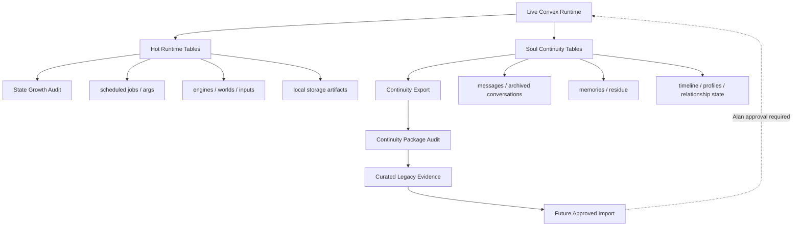

# Underworld Sustainable World System Design

Last updated: 2026-06-12

## Goal

Underworld must support long-term emotional continuity without requiring the
world to forget itself when local Convex state grows too large.

The core product requirement is:

> Hot runtime state may be compacted, rebuilt, or discarded. Soul continuity
> must remain inspectable, recoverable, and bounded.

This design keeps v0.1 focused on:

- conversation
- emotional residue
- memory continuity
- small behavioral change
- tomorrow feeling affected by yesterday

It does not introduce new lore, factions, large UI systems, or full civilization
simulation.

## Requirements

### Functional

- Preserve player-facing and character-facing continuity evidence:
  messages, archived conversations, memories, emotional residue, timeline,
  Alan-facing behavior notes, character descriptions, and relationship/daily
  state.
- Keep local runtime state from growing until Convex cannot boot.
- Export old continuity as evidence before any reset, cleanup, or import.
- Make import/restoration curated and explicit, never automatic.
- Keep old/imported rows out of fresh v0.1 sample windows.

### Non-Functional

- Read-only audits must be safe to run during normal local development.
- Heavy archive exports are manual/one-time, not part of rolling automation.
- No background task should write thousands of documents overnight.
- No cleanup should delete soul continuity first.
- All destructive cleanup requires Alan approval and a verified backup.

## High-Level Architecture



## Data Classes

### Class A: Soul Continuity

Preserve first. These are why Underworld exists.

- `messages`
- `archivedConversations`
- `participatedTogether`
- `memories`
- emotional residue / experience logs
- `schoolTimeline`
- `schoolWorldPressure` as historical context, not direct live import
- Alan behavior profiles
- character/player/agent descriptions
- relationship/daily state

### Class B: Runtime State

Allowed to shrink, compact, rebuild, or redesign.

- `_scheduled_jobs`
- `_scheduled_job_args`
- processed `inputs`
- `engines` document versions
- `worlds` document versions
- local storage artifacts
- old generated backups

### Class C: Derived Retrieval Data

Useful but rebuildable.

- memory embeddings
- vector indexes
- generated eval reports
- continuity package reports

Embeddings are not exported by default. Rebuild them after curated import if
needed.

## Current Implementation

### T1: Scheduled Args Slimming

`agentDoSomething` now schedules only IDs:

```text
worldId, playerId, agentId, operationId
```

It reloads map/player/agent/free-player context inside the action.

Observed result:

- fresh active state latest scheduled args are small ID-only/conversation/run-step
  payloads
- old archive ended with repeated 95-98 KiB map/player/agent snapshot payloads

### State Growth Audit

Command:

```bash
npm run underworld:state-audit
```

Outputs:

- `umi/reports/state-growth-audit-latest.md`

Use this for active local state. Archive mode should be fast/bounded only:

```bash
npm run underworld:state-audit -- --fast --db=<archive sqlite> --state-dir=<archive dir>
```

### Export-Only Continuity Package

Command:

```bash
npm run underworld:archive-continuity-export
```

Output:

- `umi/exports/archive-continuity-latest/`

Current package:

- 56,525 exported continuity rows
- about 40 MiB
- includes archived conversations, messages, memories, timeline,
  participated-together rows, notifications, world-pressure snapshots, Alan
  behavior profiles, and character descriptions
- excludes embeddings by default
- does not import, mutate, compact, delete, or repair state

### Continuity Package Audit

Command:

```bash
npm run underworld:continuity-package-audit
```

Output:

- `umi/reports/continuity-package-audit-latest.md`

Current verdict:

- `REVIEW_REQUIRED`
- archived conversations are present
- fallback/pollution-like text exists and must be filtered
- legacy CaoCao/Liu Bei-era text exists and must be remapped or left as history

### Curated Restore Candidates

Command:

```bash
npm run underworld:continuity-restore-candidates
```

Outputs:

- `umi/exports/curated-continuity-candidates-latest/`
- `umi/reports/curated-continuity-candidates-latest.md`

This produces capped Tier 1 / review-only / rejected candidate packets. It is a
human-review tool, not an import.

Current safeguards:

- fallback/pollution text is rejected or held for review
- rows adjacent to known polluted conversation IDs are held for review
- legacy character names are held for review
- stage-direction leakage inside/around quoted speech is held for review
- repeated food/fatigue motif families are down-ranked
- Alan behavior profiles and notifications are review-only, not first-pass
  Tier 1 imports

### Legacy Import Plan

Command:

```bash
npm run underworld:legacy-continuity-import-plan
```

Outputs:

- `umi/exports/legacy-continuity-import-plan-latest/`
- `umi/reports/legacy-continuity-import-plan-latest.md`

This creates dry-run-only `legacyContinuityEvidence` rows with
`promptFacing: false` and `freshEvalEligible: false`. It does not call Convex.

The first packet is intentionally small and conservative: default 12 dry-run
rows. It skips food-care motifs, stage-direction leaks, repeated motif families,
duplicate summaries, and non-first-restore kinds. It is still a human-review
packet, not approval to write live state.

### Legacy Import Dry Run

Command:

```bash
npm run underworld:legacy-continuity-import
```

Outputs:

- `umi/exports/legacy-continuity-import-latest/`
- `umi/reports/legacy-continuity-import-latest.md`

This validates the exact rows that a future importer would write. After Alan's
2026-06-12 approval, write mode is available only with the explicit approval
string and only writes non-prompt-facing `legacyContinuityEvidence` rows.
Current first write result: 12 rows stored, 0 prompt-facing, 0 fresh-eval
eligible. Prompt read and promotion to live memory remain proposal-only.

## Restoration Policy

Do not directly import raw rows.

Raw rows are evidence. Live continuity should be curated summaries or legacy
evidence records with provenance.

Current restore pipeline:

```text
archive export
-> package audit
-> curated candidate packet
-> dry-run legacyContinuityEvidence plan
-> Alan approval
-> future small importer
```

### First Candidate Restoration Subset

Only after audit and Alan approval:

- Alan-facing Umi memories that pass pollution review
- Umi/Mahiru/Tianze memories and timeline entries
- selected Alan behavior profile summaries only in a later, lower-weight
  evidence path
- selected notifications only in a later pass if they are human-readable
  context, not runtime control state

Every imported row must include:

- `legacyArchive: true`
- source package path
- source tableId / ts
- original document id
- import time
- import reason
- freshness policy: never count as fresh v0.1 eval evidence

### Never Directly Import

- raw `messages`
- raw `archivedConversations`
- raw `participatedTogether`
- raw `schoolWorldPressure`
- raw `agentDescriptions`
- raw `playerDescriptions`
- embeddings
- scheduled jobs / args
- engine/world/input runtime rows

## Retention Strategy

### Daily/Loop-Safe

- Run active state audit.
- Record sqlite size, state dir size, document count, scheduled-arg shape.
- Warn on growth deltas, do not auto-delete.
- Treat live sqlite `database is locked` as a transient runtime condition:
  wait/retry briefly instead of reporting the world as unhealthy.

### Manual/One-Time

- Archive continuity export.
- Archive package audit.
- Curated import proposal.
- Destructive cleanup.

### Proposal-Only

- Direct sqlite surgery.
- Schema changes.
- Moving historical location data out of `worlds`.
- Importing legacy rows into live prompt-facing state.
- Large DB cleanup.

## Known Remaining Growth Risks

### Worlds / Historical Locations

`Game.takeDiff()` currently serializes the world every step and includes
`historicalLocations`. `Game.saveDiff()` replaces the whole `worlds` document.

Small no-op diff guards may help, but the deeper fix may require moving
historical runtime location buffers out of the hot `worlds` document. That is a
schema/design change and should not be slipped in as a small patch.

### Engines / Inputs

`engines` and `inputs` naturally grow through the engine loop. Inputs should be
retained by processed cursor and safety margin, not simple age-only deletion.

### Memory Vacuum

The current age-based vacuum includes `memories` and `memoryEmbeddings`. For
Underworld, memories are soul continuity, not disposable logs. Replace this with
soul-preserving retention before relying on long-running studies.

## Operating Rules

- Fresh reset is emergency recovery only.
- Archive first, then export continuity, then decide.
- Never delete memory to solve runtime bloat before measuring runtime bloat.
- Imported legacy context must be labeled and excluded from fresh eval windows.
- Heavy archive export must not run every two hours.
- Active state audit may run daily or during morning healthcheck.
- cc should review cleanup/import design when session limits allow; if cc is
  unavailable, record the blocker and continue with bounded Codex work.

## v0.1 Acceptance For Sustainability

Underworld is not sustainable until:

- active state growth is monitored automatically
- scheduled args stay small after normal runtime activity
- old continuity can be exported without booting the old world
- export package can be audited for pollution
- curated import design exists and requires Alan approval
- memory retention no longer treats soul continuity as disposable

Success means Alan can return tomorrow and the world can remember yesterday
without the runtime state becoming unbootable.
